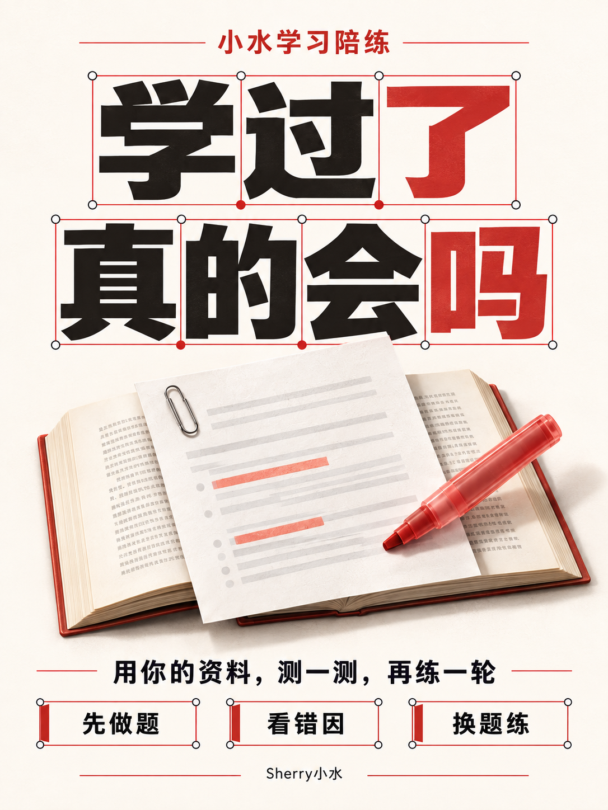
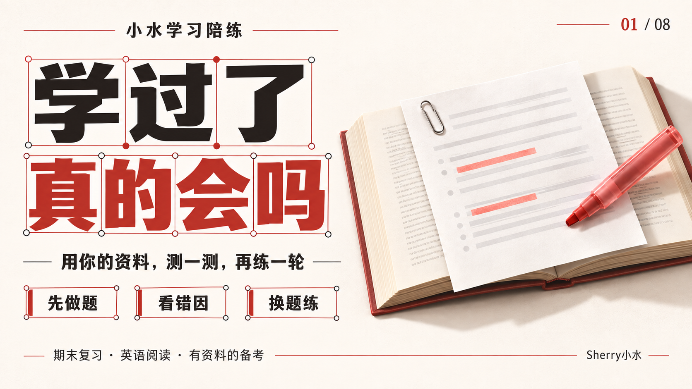
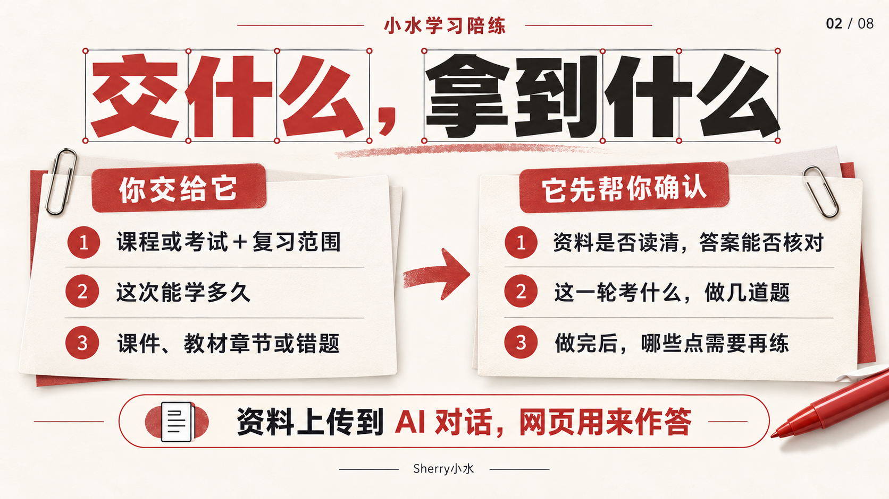
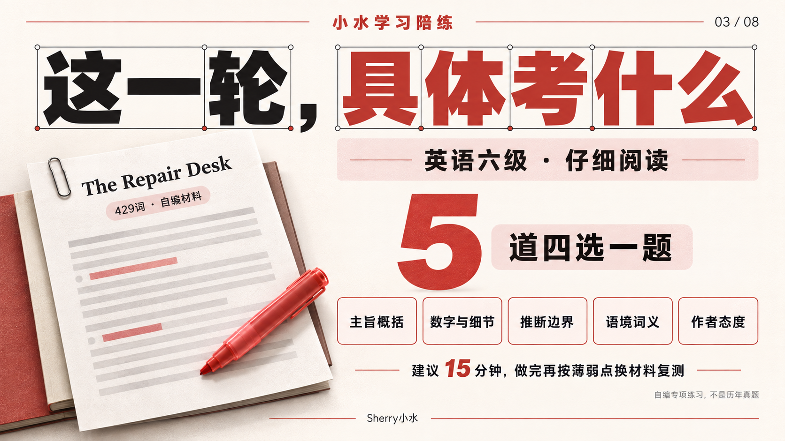
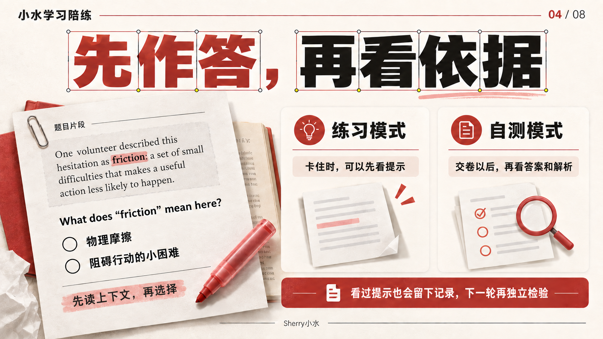
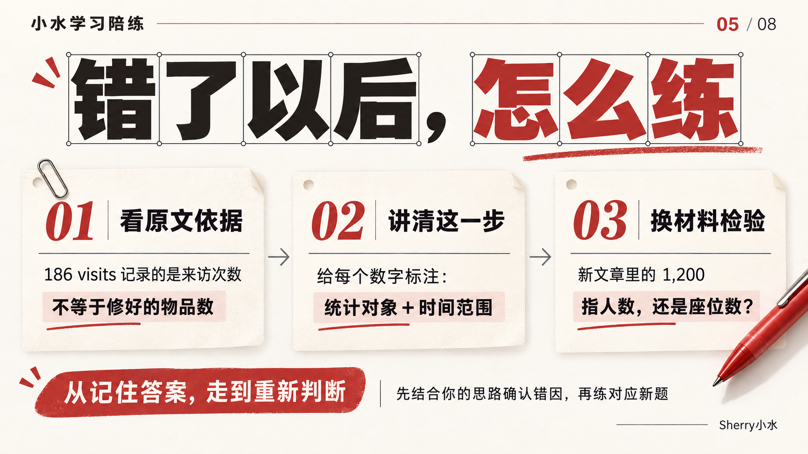
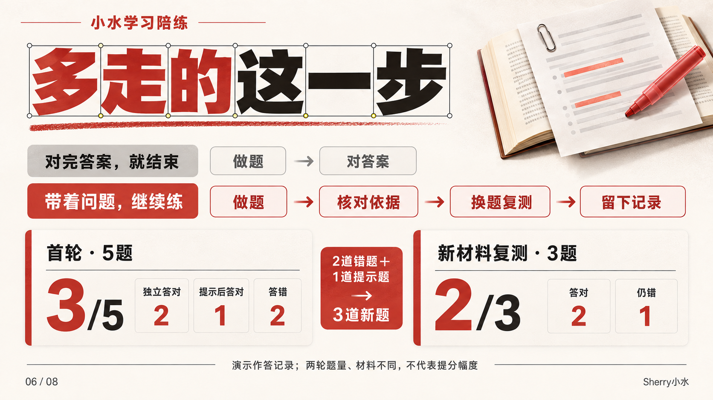
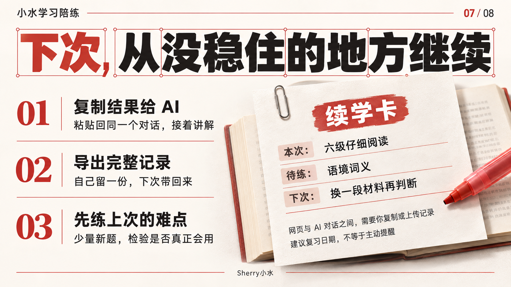
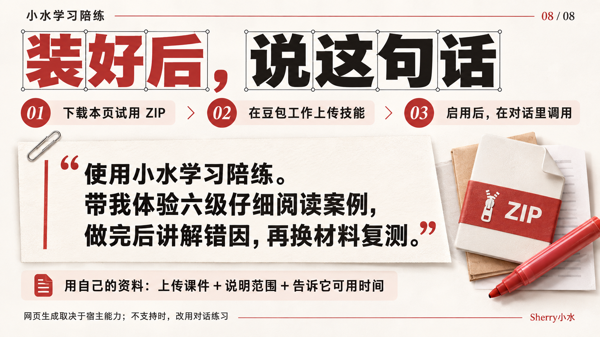

# 小水学习陪练

把课件、教材章节或错题，变成一轮能作答、能核对依据、还能换材料复测的学习过程。

适合期末复习、英语阅读、四六级和有明确资料范围的备考。



## 它怎么帮助你学习

普通刷题常停在“做完—对答案”。这个 Skill 会把这次读过的资料范围、原文依据、你的答案、提示使用情况、对应的新题和下次复习点连起来。





## 先体验六级仔细阅读

仓库自带一份可直接打开的网页：[英语六级仔细阅读陪练](examples/cet6-careful-reading.html)。

它是两篇**自编**阅读材料：第一轮 5 道四选一，覆盖主旨、细节、推断、词义和态度；答错、用过提示或标记疑问的点，会在另一篇文章中用新题复测。不是历年真题，也不换算官方成绩。









## 在豆包工作里怎么用

GitHub 链接本身不会自动把 Skill 安装到豆包。下载本仓库的 ZIP，解压后上传 `shui-study-coach` Skill 文件夹或上传整理好的 Skill ZIP 到你自己的豆包工作入口；启用后，在对话里直接发送下面这段：

```text
使用小水学习陪练。带我体验内置的六级仔细阅读案例。先告诉我这次考什么、材料是什么、几道题；做完后按我的错题讲解，再换一篇材料出新题复测。
```

用自己的资料时，先在 AI 对话里上传课件、教材章节或自己有权使用的试卷，再发送：

```text
使用小水学习陪练。我在准备【考试或课程】，这次只复习【章节或题型】，有【15】分钟。请先确认你读到了哪些资料、题目和答案，再给我一组短练习。做完后告诉我错在哪里、原文依据是什么，并针对没稳住的点换题复测。
```

网页用于作答；资料上传和错因讲解发生在 AI 对话里。若当前宿主不能生成可打开的网页，就改为在对话里逐题练习。





## 能做与边界

- 已有：单选、多选、判断；提示与疑问标记；客观题判分；答案依据；按待检验点抽新题；两轮对比；本地进度、结果复制与 JSON 导入导出。
- 不提供：内置版权真题库、网页直接上传试卷、自动推送、云端账号、发音评分或正式考试防作弊。
- 网页前端带有答案，只适合个人练习，不能用于保密考试。
- 选项只能给出错因线索，真正原因需要结合学习者自己的思路确认。

## 本地运行与验证

不需要第三方 Python 依赖。需要 Python 3.9+。

```bash
python3 -m unittest discover -s tests -p 'test_*.py'
```

已验证：14 项 Python 测试；CET6 演示通过浏览器自动化检查。实际豆包导入和网页生成能力会受账户与宿主环境影响，首次使用请自己试一次。

## 作者、方法参考与许可

作者：Sherry小水。实现代码、网页模板和自编样题均为本项目编写；教学流程的参考与边界见 [SOURCES.md](SOURCES.md)。仓库不分发书籍正文、版权真题或上游代码。

本项目采用 [CC BY-NC-SA 4.0](LICENSE)：允许个人使用与改编，须署名 Sherry小水，不可商用；改编后须以相同许可发布。
